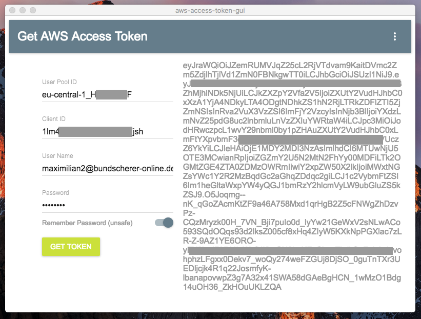
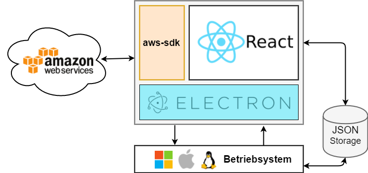

# Get a Amazon Web Service Token via GUI
A small proof of concept with React, Electron and AWS-SDK. 
More Infos in German - [innFactory.de/blog](https://innfactory.de/blog/52-javascript-desktop-app-electron)



<br />
<br />


## Install & Packaging
Clone project:
```
$ git clone https://github.com/innFactory/aws-session-token-gui.git
```

Install dependencies:
```
$ cd aws-session-token-gui
$ npm install
```

Package the app for your local platform:
```
$ npm run package
```

<br />
<br />

## Architecture


## Dependencies

electron-react-boilerplate<br />
https://github.com/chentsulin/electron-react-boilerplate

<br />

material-ui<br />
https://github.com/callemall/material-ui

<br />

reflexbox<br />
https://github.com/jxnblk/reflexbox

<br />

electron-json-storage<br />
https://github.com/jviotti/electron-json-storage

<br />

aws-sdk-js<br />
https://github.com/aws/aws-sdk-js

